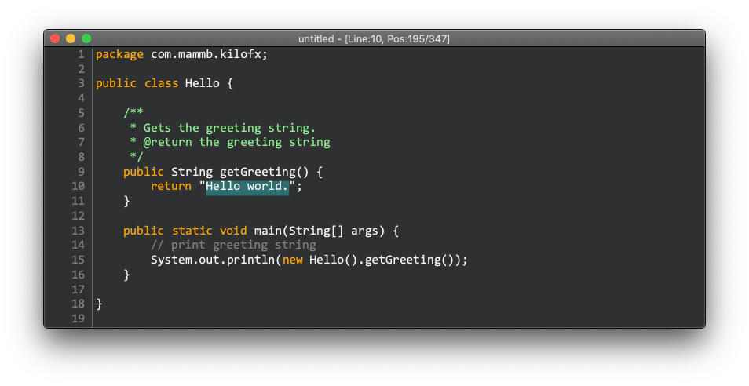

# KiloFx

KiloFX is a small text editor in less than 1K lines of code (counted with cloc).



```
$ brew install cloc
$ cloc src/main/java
--------------------------------------------------------------------
Language        files          blank        comment           code
--------------------------------------------------------------------
Java                2            164             38            998
--------------------------------------------------------------------
SUM:                2            164             38            998
--------------------------------------------------------------------
```

KiloFX uses only JDK and JavaFx(only low level components).

Original is [hear](https://github.com/antirez/kilo).


## Usage

JDK 11+ is required.

Run the following command:

```
$ ./gradlew run
```

To specify the file, use the following command:

```
$ ./gradlew run --args="pathToFile"
```

## Feature

This is a toy application.

* Keyword highlight(incomplete)
* IME support
* Undo, Redo
* Mouse operation(Double-click to select a word, etc)
* Not implemented line wrap
* Not implemented scroll bar
* Not implemented text search


## Keys

| Key             | description           |
|-----------------|-----------------------|
|Arrow            | Move caret            |
|Home             | Move to head of line  |
|End              | Move to tail of line  |
|Delete           | Delete next character |
|BS               | Delete prev character |
|End              | Move to tail of line  |
|Ctrl + O         | Open file             |
|Ctrl + S         | Save                  |
|Ctrl + Shift + S | Save as               |
|Ctrl + C         | Copy                  |
|Ctrl + X         | Cut                   |
|Ctrl + V         | Paste                 |
|Ctrl + Z         | Undo                  |
|Ctrl + Shift + Z | Redo                  |

